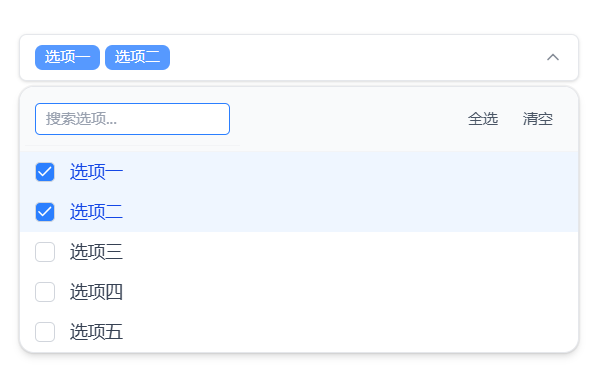

# Simple Vue Tailwind MultiSelect

一个简易的基于 Vue 3 + TypeScript + Tailwind CSS 的多选下拉组件。

## ☀️ 使用

主要是写来自用的，所以没发布npm包，
自己复制代码到项目中使用，自己按需修改即可

## ✨ 特性

- 🎨 **现代化 UI 设计** - 基于 Tailwind CSS 的精美界面
- 🔍 **实时搜索** - 支持输入关键词过滤选项
- ⚡ **高性能** - 基于 Vue 3 Composition API
- 📱 **响应式设计** - 适配各种屏幕尺寸
- 🎯 **全选/清空** - 快速操作所有选项
- 🔧 **TypeScript 支持** - 完整的类型定义
- ♿ **无障碍访问** - 符合可访问性标准
- 🎭 **过渡动画** - 流畅的展开/收起效果

## 📸 演示



## 🚀 快速开始

### 安装依赖

```bash
pnpm install
```

### 启动开发服务器

```bash
pnpm dev
```

### 构建生产版本

```bash
pnpm build
```

## 📦 使用方法

### 基本用法

```vue
<template>
  <MultiSelect
    v-model="selectedOptions"
    :options="options"
    id="multi-select"
    name="multi-select"
    placeholder="请选择选项"
    required
  />
</template>

<script setup lang="ts">
import MultiSelect from '@/components/MultiSelect.vue'
import { ref } from 'vue'

const options = [
  { value: 'option1', name: '选项一' },
  { value: 'option2', name: '选项二' },
  { value: 'option3', name: '选项三' },
]

const selectedOptions = ref<(string | number)[]>([])
</script>
```

### Props 参数

| 参数          | 类型           | 必填 | 默认值  | 说明         |
| ------------- | -------------- | ---- | ------- | ------------ |
| `options`     | `OptionItem[]` | ✅   | -       | 选项列表     |
| `id`          | `string`       | ✅   | -       | 组件 ID      |
| `name`        | `string`       | ✅   | -       | 表单字段名称 |
| `required`    | `boolean`      | ✅   | -       | 是否必填     |
| `placeholder` | `string`       | ✅   | -       | 占位符文本   |
| `disabled`    | `boolean`      | ❌   | `false` | 是否禁用     |

### OptionItem 类型

```typescript
interface OptionItem {
  name: string // 显示名称
  value: string | number // 选项值
}
```

## 🛠️ 技术栈

- **Vue 3** - 渐进式 JavaScript 框架
- **TypeScript** - JavaScript 的超集
- **Tailwind CSS** - 实用优先的 CSS 框架
- **Vite** - 下一代前端构建工具
- **VueUse** - Vue 组合式 API 工具集
- **Lucide Vue** - 精美的图标库

## 📁 项目结构

```
src/
├── components/
│   └── MultiSelect.vue    # 多选组件
├── views/
│   └── HomeView.vue       # 示例页面
├── router/
│   └── index.ts           # 路由配置
├── assets/
│   └── main.css           # 全局样式
└── main.ts                # 应用入口
```

## 🎯 功能特点

### 搜索过滤

- 实时搜索选项
- 支持中文搜索
- 无匹配项提示

### 批量操作

- 全选功能：一键选择所有选项
- 清空功能：一键清除所有选择

### 交互体验

- 平滑的过渡动画
- 点击外部区域关闭
- 键盘导航支持
- 响应式设计

### 视觉设计

- 现代化界面
- 选中状态高亮
- 悬停效果
- 禁用状态样式

## 🔧 开发环境

### 开发命令

```bash
# 安装依赖
pnpm install

# 启动开发服务器
pnpm dev

# 类型检查、编译和压缩 (生产环境)
pnpm build

# 预览生产构建
pnpm preview

# 代码检查和修复
pnpm lint

# 代码格式化
pnpm format
```

## 🤝 贡献指南

1. Fork 本仓库
2. 创建特性分支 (`git checkout -b feature/AmazingFeature`)
3. 提交更改 (`git commit -m 'Add some AmazingFeature'`)
4. 推送到分支 (`git push origin feature/AmazingFeature`)
5. 开启 Pull Request

## 🙏 致谢

- [Vue.js](https://vuejs.org/) - 渐进式 JavaScript 框架
- [Tailwind CSS](https://tailwindcss.com/) - 实用优先的 CSS 框架
- [Vite](https://vitejs.dev/) - 下一代前端构建工具
- [Lucide](https://lucide.dev/) - 精美的图标库

---

如果这个项目对你有帮助，请给它一个 ⭐️！
